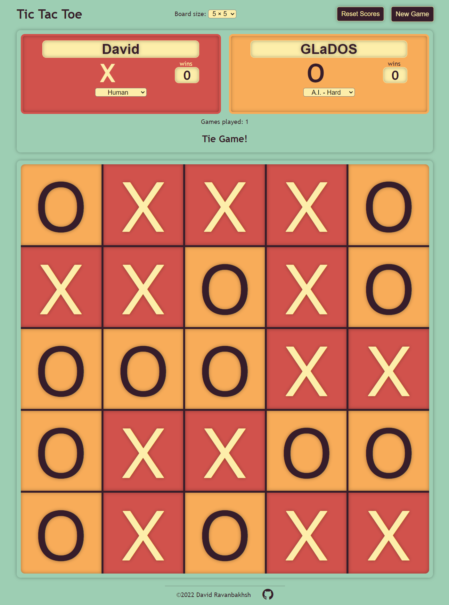

# tic-tac-toe

## Description
This is the game of Tic-Tac-Toe, with the option to extend the game board size from *3x3* up to *6x6*. This project was created entirely with *html*, *css*, and *javascript*.
  

**Live link**:
https://ravanbak.github.io/tic-tac-toe/
  

## How to Play
On the *3x3* game board, the first player to place **three marks in a row** wins.

On larger game boards, the first player to place **four marks in a row** wins.

In my experience, *5x5* and *6x6* are the most fun to play because there's more of a chance of winning, as opposed to always ending the game in a tie.

Each player can be either *human* or *AI*, with three difficulty levels of AI.
  

## Screenshot

   
  
## Notes on the AI

I first used a basic [*minimax*](https://en.wikipedia.org/wiki/Minimax) algorithm to search the entire game tree for the best next move. This worked fine on a *3x3* game board because the search tree is relatively small. 

On larger game boards, though, the size of the search tree became a problem. At the beginning of the game, when the search tree is largest, minimax would take hours (if not days) to find the best move.

To improve performance, I did the following:

- Added **alpha-beta pruning** to avoid searching some of the unnecessary subtrees.

- Created a separate Web Worker for each empty square on the game board at the beginning of an AI player's turn, allowing multiple minimax searches to run **concurrently**.

- In cases where the game board is symmetric about any central axis (horizontal, verical, or diagonal), I eliminated 'mirror-image' squares from consideration by the AI. In other words, moves that were **transpositions** of already-considered moves were eliminated.

- Added **iterative deepening**, where minimax is run multiple times with increasing maximum recursion depth each time. After each iteration, the minimax score for each square is used to sort the squares before they are considered by the next iteration (**move ordering**). This caused the alpha-beta pruning to be much more effective and resulted in a significant performance increase.

- Added a very basic **heuristic evaluation function** to calculate a score for gameboard states when minimax was not able to reach a leaf node of the search tree (because of depth limiting).

Below is an example of the resulting performance improvements on a 5x5 game board, where the AI is making the second move of the game. All tests were done with minimax and alpha-beta pruning and a maximum search depth of 9 plys, and run on my desktop computer:

### Time for the AI to decide on next move:

| AI implementation | Time |
| --------------|-------------|
| single thread | **858s** |
| multiple concurrent workers | **239s** |
| multiple concurrent workers + iterative deepening | **266s** (note: slighly slower)
| multiple concurrent workers + iterative deepening + move ordering | **80s**

***

## Possible future improvements:
- transposition table (hash table containing previously evaluated moves) for minimax
- opening book of moves for AI
- change the configuration of marks required to win on larger boards, possibly allow four marks in a square in addition to four marks in a row
- color schemes, dark mode
- visually indicate the most recent move on the game board because, if you're not paying attention, you can't tell where your opponent just played